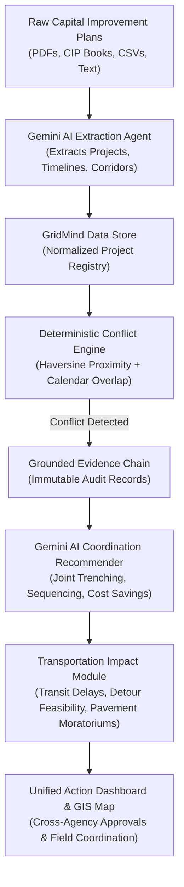
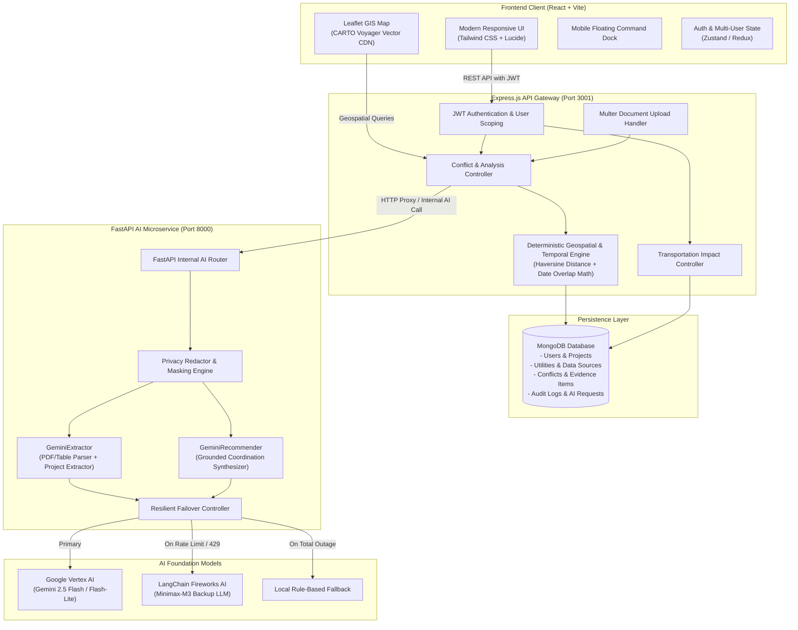

# GridMind — Intelligent Municipal Infrastructure & Utility Coordination Platform

> **AI-Driven Infrastructure Coordination, Subsurface Conflict Prevention, and Smart City Street Management**

---

## 🌍 Real-World Problem: The "Pave and Dig" Crisis

In modern cities and municipalities, billions of dollars are wasted every year on uncoordinated underground utility work:
- A Department of Transportation spends **$2.5M paving an arterial avenue**.
- Three months later, the **electric authority cuts a trench** to lay high-voltage feeder cables.
- Six months later, the **gas utility tears open the same road** for pipe replacement, followed by telecom laying fiber optic conduits.

This uncoordinated cycle—known in municipal engineering as the **"Pave-and-Dig" dilemma**—causes:
1. **Severe Traffic Congestion & Economic Loss**: Blocked bus routes, delayed commuters, and snarled freight corridors.
2. **Pavement Degradation**: Street cuts reduce roadway structural lifespan by **up to 50%**, forcing premature repaving.
3. **Violated Pavement Moratoriums**: Municipalities impose 3- to 5-year moratoriums on cutting freshly paved streets, yet lack unified cross-agency visibility to enforce them.
4. **Data Silos**: Water, electric, gas, transit, and telecom entities operate on separate legacy software, proprietary GIS databases, or static PDF Capital Improvement Plans (CIPs).

**GridMind** solves this crisis by acting as a **neutral, unified municipal coordination engine** powered by **Google Gemini AI**. It continuously ingests disparate utility plans, mathematically calculates spatial and temporal excavation conflicts, and synthesizes authoritative joint-trenching and sequencing strategies before a single shovel strikes the ground.

---

## ⚡ How the Application Works at a Glance



1. **Ingest**: Agencies submit Capital Improvement Plans (CIPs), work orders, or spreadsheets.
2. **Extract with AI**: **Gemini AI** extracts structured infrastructure projects (coordinates, dates, corridor names, scopes).
3. **Evaluate Deterministically**: Mathematical spatial algorithms compute exact distances and schedule overlaps.
4. **Synthesize Recommendations**: **Gemini AI** evaluates overlapping engineering scopes and generates actionable conflict resolutions (e.g. Joint Trenching, Post-Water Paving).
5. **Assess Transportation Impact**: Evaluates arterial corridor congestion, bus routes, detour feasibility, and moratorium compliance.
6. **Coordinate & Execute**: City planners and utility managers review the interactive GIS map, approve joint schedules, and prevent duplicate street cuts.

---

## 🧠 How Gemini AI Powers GridMind

GridMind uses **Google Gemini AI** as its primary cognitive engine across two core subsystems, backed by strict privacy controls and resilient failover.

### 1. Document & Plan Extraction Agent (`GeminiExtractor`)
- **The Challenge**: Municipal utility plans exist in 300-page PDF Capital Improvement Plans, messy bid specifications, budget tables, and inconsistent spreadsheets.
- **The Gemini Solution**:
  - Ingests raw text and parsed tables from PDF documents and spreadsheets.
  - Automatically identifies infrastructure scopes: water main replacements, electric feeder undergrounding, storm sewer enlargements, gas main rehabilitation, and fiber conduit installations.
  - Normalizes start/end dates into ISO standards, resolves corridor and intersection names, and estimates geographic coordinates.
  - Outputs structured, validated JSON project objects with confidence scores.

### 2. Grounded Coordination & Synthesis Agent (`GeminiRecommender`)
- **The Challenge**: Knowing two utilities are digging on the same street is only half the battle; knowing **how** to coordinate their complex engineering requirements is what prevents millions in wasted excavation.
- **The Gemini Solution**:
  - Receives deterministic conflict facts: precise Haversine distance, exact calendar overlap days, corridor names, and both projects' technical scopes.
  - Generates concrete, prioritized engineering recommendations:
    - **Joint Trenching Agreements**: Placing power and telecom or water and gas in shared rights-of-way.
    - **Optimized Construction Sequencing**: Guaranteeing deep subsurface pipe replacement occurs *before* surface repaving.
    - **Shared Work Zone Traffic Control**: Combining lane closures to preserve public transit flow.
  - Evaluates operational justifications, risks, and missing data limitations.

### 3. Enterprise Privacy & Redaction Governance
Infrastructure data often involves critical municipal assets. GridMind provides three configurable AI privacy tiers:
- **`public_only`**: Automatically strips private user credentials, developer secrets, and internal comments before prompting.
- **`redacted`**: Masks specific facility names (e.g., transforming sensitive electrical substation titles into cryptographic pseudonyms like `E████c S██████n`) and generalizes corridor coordinates to a 250-meter grid sector.
- **`internal`**: Full context provided for internal secure agency deployments.

### 4. High-Availability AI Pipeline (Gemini + Fireworks AI Backup)
To ensure uninterrupted mission-critical city operations during high traffic or API rate limits:
- **Primary**: **Google Vertex AI Gemini 2.5 Flash / Flash-Lite**.
- **Secondary (Failover)**: **LangChain ChatFireworks (`minimax-m3`)** automatically activates if Gemini returns 429 quota exhaustion or network timeouts.
- **Tertiary (Safety Net)**: Local deterministic synthesis engine guarantees valid conflict recommendations even if all external cloud AI providers are offline.

---

## 🛠️ Complete Working Features

| Feature | Description | Real-World Value |
| :--- | :--- | :--- |
| **Interactive GIS Conflict Map** | Geospatial visualization using high-speed vector tiles, color-coded utility corridors, conflict pins, and interactive detail flyouts. | Field engineers and public works directors visualize overlapping work zones across the entire municipality on one screen. |
| **Document & Data Source Ingestion** | Upload PDF CIP documents, paste raw text, or upload CSV/JSON files. Gemini extracts all infrastructure projects automatically. | Eliminates weeks of manual data entry from 200+ page municipal budget and planning books. |
| **Deterministic Conflict Engine** | Evaluates project pairs using the Haversine distance formula and calendar intersection algorithms with customizable spatial (10m–500m) and temporal thresholds. | **Zero hallucination** in spatial arithmetic. Distances and day overlaps are computed mathematically, never guessed. |
| **Grounded Evidence Items** | Every detected conflict generates immutable evidence records linking to the exact source documents, calculations, and dates. | Provides an auditable legal and operational paper trail for inter-agency coordination hearings. |
| **Transportation Impact Analysis** | Automatically assesses traffic sensitivity, impacted bus transit routes, detour feasibility, and pavement moratorium risks. | Protects city transit schedules and saves freshly paved asphalt roads from illegal trench cuts. |
| **AI Control & Telemetry Center** | Live dashboard to switch AI model tiers (Gemini Flash, Flash-Lite, Fireworks AI), toggle privacy modes, and monitor token usage, latency, and estimated costs. | Complete operational transparency into AI spending, speed, and privacy compliance. |
| **Multi-Agency Utility Management** | Register and manage regional municipal utilities (Water, Power, Telecom, Gas, Transit) with custom service areas. | Clean categorization of private and public utility operators within the city. |
| **Secure Multi-User Workspace** | Full authentication and data partitioning ensuring each user/agency sees their dedicated projects, analyses, and alerts. | Prevents cross-agency data leaks while enabling controlled municipal collaboration. |
| **Responsive Mobile Floating Command Dock** | Floating dock navbar with quick navigation and expandable drawer designed specifically for mobile and field tablet viewports. | Inspectors and site supervisors can access project alerts and conflict data directly from construction sites. |

---

## 🏢 How GridMind Operates in the Real World

### Persona 1: The Municipal Director of Public Works
1. **Annual Review**: In November, the director receives capital improvement plans from the City Water Authority, Electric Power Co., and Regional Transit.
2. **Instant Ingestion**: Uploads the 3 PDF planning documents into GridMind's **Sources** page.
3. **Automated Discovery**: Gemini extracts 140 projects across the three agencies within minutes.
4. **Conflict Identification**: The conflict engine immediately flags **18 major spatial and temporal collisions**, including an electric trench scheduled two weeks after a newly approved asphalt resurfacing project.
5. **AI Mitigation**: Gemini generates a **"Paving Delay & Joint Trenching Order"**, recommending that the electric conduit installation be moved forward by 10 days to share the trench with telecom, followed by single-pass asphalt restoration.
6. **Result**: The city saves **$420,000** in repaving costs and avoids a 45-day lane closure on a prime arterial corridor.

### Persona 2: The Water & Wastewater Utility Engineer
1. **Planning Subsurface Replacement**: Planning a 1.2 km water main replacement along an urban transit corridor.
2. **Inputting Region**: Enters the planned project corridor into GridMind.
3. **Transportation Alert**: GridMind's Transportation module alerts that 2 major bus lines share the corridor during the planned construction window.
4. **Detour & Transit Mitigation**: The system calculates detour feasibility via parallel collector streets 400 meters away, enabling the engineer to coordinate bus lane diversions with the transit authority months before breaking ground.

---

## 🏛️ System Architecture

GridMind uses a decoupled, event-resilient microservice architecture engineered for high availability, deterministic spatial precision, and auditable AI synthesis.



### Architectural Principles

1. **Separation of Arithmetic and Synthesis**:
   - LLMs are **never** trusted to calculate distances or check calendar overlaps.
   - Physical coordinates are calculated via pure spherical trigonometry (Haversine formula on Earth radius $R = 6,371,000$ meters).
   - Date overlaps are computed deterministically via timestamp boundary comparisons.
   - **Gemini AI** is exclusively utilized for qualitative engineering analysis, scope comprehension, and multi-agency strategy synthesis.

2. **Immutable Evidence Chains**:
   - Every conflict record references concrete `EvidenceItem` records containing the source document excerpt, calculation values, and exact timestamps.
   - City councils, legal auditors, and utility executives can trace any AI recommendation back to its underlying physical and temporal source facts.

3. **Multi-Tenant User Isolation**:
   - All queries to MongoDB are strictly scoped by the authenticated user's ID (`ownerId: req.user._id`), preventing data cross-contamination across competing contractors or municipal departments.

4. **Zero-Downtime Multi-CDN GIS Maps**:
   - All interactive maps stream vector tiles via the high-availability CARTO Voyager CDN with automatic fallback to Esri World Imagery, eliminating HTTP 429 tile rate limits.

---

## 📋 Key Municipal & Engineering Concepts

### What is a Pavement Moratorium?
When a city repaves a street, it legally freezes excavation on that street for **3 to 5 years**. If a utility must cut open a road under moratorium, it incurs massive financial penalties and is required to repave the entire street from curb to curb. GridMind alerts utilities to planned street resurfacings *before* they occur, allowing underground work to be completed beforehand.

### What is Joint Trenching?
Instead of four separate contractors digging four separate 1-meter trenches for electric conduits, gas lines, telecommunications fiber, and cable TV, **joint trenching** allows multiple utilities to share a single wide excavation. This cuts civil engineering costs by **30%–60%**, minimizes traffic delays, and prevents repeated street cuts.

### What is Subsurface Utility Engineering (SUE)?
SUE is an engineering discipline that categorizes underground utility data quality from Quality Level D (basic historical records) to Quality Level A (precise vacuum potholing). GridMind ingests multi-format SUE data and provides grounded confidence metrics for all detected conflicts.

---

## 🚀 Quick Start & Development

### Prerequisites
- **Node.js**: v18+ 
- **Python**: v3.11+
- **MongoDB**: Local or MongoDB Atlas instance
- **Google Cloud Vertex AI** or **Gemini API Key**
- **Fireworks AI API Key** *(optional, for fallback)*

### Environment Variables
Configure `.env` in the root and service directories:
```bash
# Backend (.env)
PORT=3001
MONGODB_URI=mongodb://localhost:27017/gridmind
JWT_SECRET=super_secret_jwt_key_sample_min_32_chars
FASTAPI_URL=http://localhost:8000
CLIENT_URL=http://localhost:5173

# FastAPI (fastapi/.env)
PROJECT_ID=your-gcp-project-id
GEMINI_LOCATION=us-central1
GEMINI_MODEL=gemini-2.5-flash
FIREWORKS_API_KEY=your_fireworks_api_key_here
FIREWORKS_MODEL=accounts/fireworks/models/minimax-m3
```

### Running the System
```bash
# 1. Start MongoDB
mongod --dbpath /path/to/data

# 2. Start the Express Backend
cd backend
npm install
npm run dev

# 3. Start the FastAPI AI Microservice
cd fastapi
python -m venv .venv
source .venv/bin/activate
pip install -r requirements.txt
uvicorn app.main:app --port 8000 --reload

# 4. Start the Frontend
cd frontend
npm install
npm run dev
```

Visit `http://localhost:5173` to access the GridMind platform.

---

## 📄 License
This project is open-source under the [MIT License](LICENSE).
